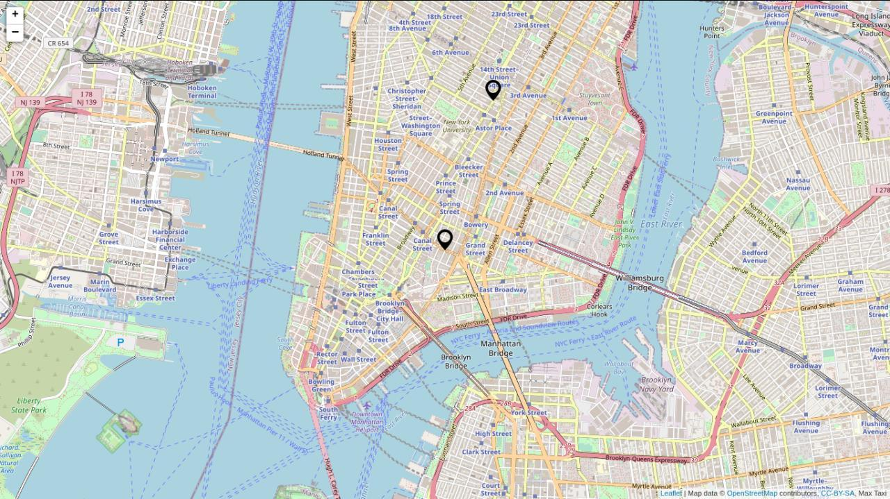

# Leaflet Example

A web page to select the origin and destination location in the Map using Leaflet library.

### Related Repositories

- https://github.com/BaseMax/TaxiBookingMap
- https://github.com/BaseMax/RouteDistance
- https://github.com/BaseMax/TaxiMapBooking
- https://github.com/BaseMax/MyAddressGoogleMaps
- https://github.com/BaseMax/MapboxWebExample

---------

# Max Base

My nickname is Max, Programming language developer, Full-stack programmer. I love computer scientists, researchers, and compilers. ([Max Base](https://maxbase.org/))

## Asrez Team

A team includes some programmer, developer, designer, researcher(s) especially Max Base.

[Asrez Team](https://www.asrez.com/)

